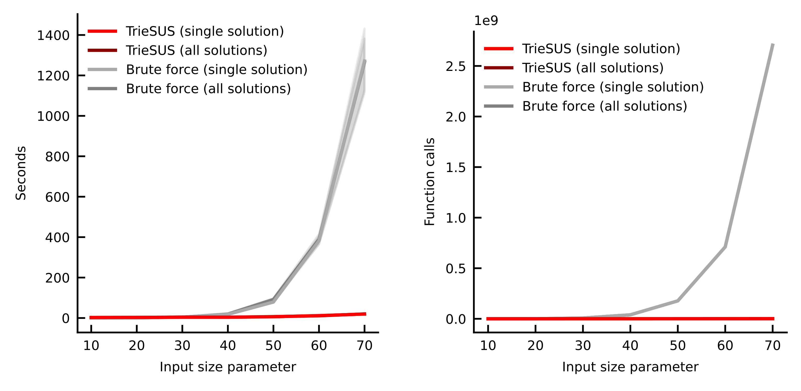

# TrieSUS benchmark

A readily reproducible workflow to benchmark the algorithm [TrieSUS](https://github.com/alussana/TrieSUS).

Both the code and the environment are self-contained in this repository, according to the portable workflow model illustrated in this [project template](https://github.com/alussana/nf-project-template).

Requires [Nextflow](https://www.nextflow.io), [Docker](https://www.docker.com) and [Apptainer](https://apptainer.org).

Generate the required Apptainer image:

```bash
docker build -t triesus_benchmark - < env/Dockerfile
docker save -o env/triesus_benchmark.tar.gz triesus_benchmark
apptainer build env/triesus_benchmark.sif docker-archive://env/triesus_benchmark.tar.gz
```

Run the workflow:

```bash
nextflow run main.nf -resume
```

The results and figures will be saved in `nf_public/`.

<p align="center">
  <br>
  
  <br>
</p>

<p align="center">
  <br>
  
  <br>
</p>